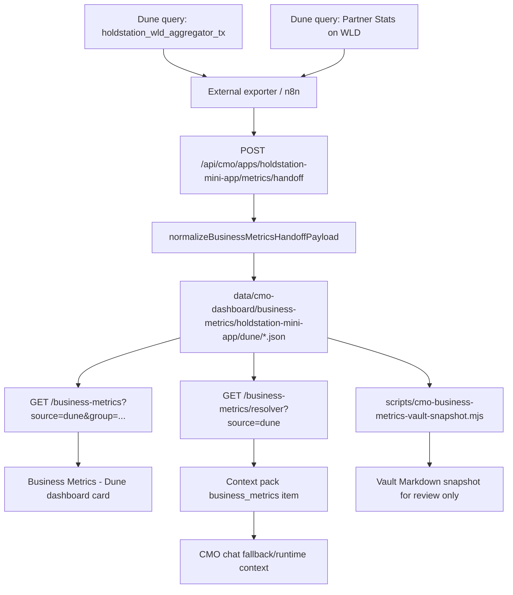

# M12A-0 Dune Metrics & Flow Audit

Audited on: 2026-06-19
Repo: `C:\Holdstation\Vibe Coding\CMO Engine OpenClaw`
Scope: read-only audit of current Dune/business metrics UI, data flow, contract, chat exposure, and n8n handoff. No native connector implementation.

## Executive Summary

The Product repo already has a Dune / Worldchain business metrics contract and UI, but it is not a native Dune connector. Current Product behavior is file-backed: an external workflow, documented as n8n or another exporter, posts normalized `cmo.metrics-handoff.v1` payloads to Product, and Product writes `cmo.business-metrics.v1` JSON files.

Current local checkout has no persisted Dune business metrics JSON files and no Dune Vault snapshot directory. With this checkout as-is, the dashboard and CMO chat resolver fall back to missing snapshots / `No data`. Test scripts contain temporary fixtures, but those are restored or in-memory and are not production data.

Product currently does not call Dune directly. Search found no Dune API URL, no Dune API key env, and no native Dune HTTP client.

## Source Map

| Area | Current file or path | Role | Notes |
| --- | --- | --- | --- |
| Handoff write endpoint | `src/app/api/cmo/apps/[appId]/metrics/handoff/route.ts` | Accepts external metrics handoff POST | Uses `x-cmo-metrics-ingest-key` when `CMO_METRICS_INGEST_API_KEY` is set. In production, missing key blocks writes. |
| Normalizer / file writer | `src/lib/cmo/business-metrics.ts` | Validates handoff, normalizes to `cmo.business-metrics.v1`, writes JSON | Only `holdstation-mini-app` supported for business metrics. Authoritative source defaults to `dune`. |
| Read endpoint | `src/app/api/cmo/apps/[appId]/business-metrics/route.ts` | Reads one metric group | `GET ...?source=dune&group=wld_aggregator_daily` or `wld_partner_stats_daily`. |
| Resolver endpoint | `src/app/api/cmo/apps/[appId]/business-metrics/resolver/route.ts` | Reads both Dune groups and builds compact summary | Returns `cmo.business-metrics-resolver.v1`. |
| Dashboard UI | `src/components/cmo-apps/app-workspace-view.tsx` | Renders `Business Metrics - Dune` card and charts | Shown only for `app.id === "holdstation-mini-app"`. |
| CMO context pack | `src/lib/cmo/context-pack-builder.ts` | Adds business metrics to chat context when resolver is not missing | Source type is `business_metrics_json`; summary text only. |
| Local runtime fallback | `src/lib/cmo/runtime.ts` | Detects Dune/business metric questions and answers from context pack if present | Refuses exact metrics when Dune JSON context is missing. |
| Vault snapshot script | `scripts/cmo-business-metrics-vault-snapshot.mjs` | Generates human-readable Markdown snapshot from JSON | Markdown is review/provenance only, not source of truth. |
| Contract / runbook | `docs/PRODUCTION_RUNBOOK.md` | Documents accepted scope, groups, series, endpoints, source boundary | States n8n exports Dune data and CMO does not call Dune directly. |
| Tests / checks | `scripts/cmo-dune-business-metrics-check.mjs`, `scripts/cmo-business-metrics-dashboard-check.mjs`, `scripts/cmo-business-metrics-resolver-check.mjs`, `scripts/cmo-dune-business-metrics-chart-check.mjs` | Smoke/contract/chart checks | These create or use fixture Dune data for validation and restore files when needed. |
| Current JSON source of truth | `data/cmo-dashboard/business-metrics/holdstation-mini-app/dune/*.json` | Expected persisted Dune snapshots | Directory/files are absent in this checkout. |
| Current Dune Vault snapshot | `knowledge/holdstation/07 Knowledge/Data/Business Metrics/Holdstation Mini App/Dune/...` | Expected human review snapshots | Directory is absent in this checkout. |
| App memory | `knowledge/holdstation/02 Apps/World Mini App/Holdstation Mini App/App Memory.md` | Durable app memory | No exact Dune metrics found there. |
| Mock graph only | `src/components/vault-graph/vault-graph-mock-data.ts` | Mock UI graph references to Dune | Not authoritative data. |

## Current Data Flow

No Product path currently calls Dune directly. Refresh/update happens only when an external handoff POST writes JSON, or when local smoke scripts temporarily write fixture files.

## UI Map

Component: `src/components/cmo-apps/app-workspace-view.tsx`

Display gate:

- `showBusinessMetrics = app.id === "holdstation-mini-app"`.
- Fetches both Dune groups in parallel with `cache: "no-store"`.
- If either group endpoint succeeds, card status becomes ready; each missing group renders its own missing state.

Card header badges:

- `Dune`
- combined status: `Connected`, `Partial`, `Missing`, or `Loading`
- `Source: Dune / Worldchain`
- `App: {app.name}`
- `Query: holdstation_wld_aggregator_tx`
- `Query: Partner Stats on WLD`
- `Last updated: {timestamp}` or `Not connected`
- `Available to CMO Chat` with green only when any Dune metrics have data
- `Contract: cmo.business-metrics.v1`

Sections rendered:

| UI section | Source group | Card values |
| --- | --- | --- |
| WLD Aggregator Daily | `wld_aggregator_daily` | Latest Daily Transactions, Cumulative Transactions, Latest Daily Volume, Cumulative Volume, Latest Fee Amount |
| Partner Stats | `wld_partner_stats_daily` | Partner Total Volume, Partner Total Transactions, Active Partners, Top Partner by Volume, Top Partner by Transactions |
| WLD Aggregator Charts | `wld_aggregator_daily.series[].points` | Count Daily Transaction, Daily Volume in USD |
| Partner Stats Charts | `wld_partner_stats_daily.series[].points` and `tables[].rows` | Daily Partner Volume, Partner Volume, Daily Partner Transaction Count, Partner Transaction Count |

Formatting:

- `BusinessMetricTile` uses `metric.displayValue` when non-`No data`.
- If display value is absent, `usd` values render as `$` with up to 2 decimals.
- `count` values render with `Intl.NumberFormat("en-US")`.
- Text metrics use `textValue` or `displayValue`.
- Missing metrics show `No data` and slate badge.
- Chart values use compact count / compact USD formatting.
- Chart point parsing turns invalid/missing numeric fields into `0`.

Hardcoded/fallback/mock values:

- Metric definitions, labels, units, default descriptions, accepted groups, and default query names are hardcoded in `business-metrics.ts`.
- Dashboard query badges are hardcoded in `app-workspace-view.tsx`.
- Dashboard fallback reads return a missing `cmo.business-metrics.v1` snapshot when JSON files are absent.
- Chart check script has in-memory fixtures if JSON is absent.
- Handoff/dashboard/resolver smoke scripts write fixture JSON and then restore original files.
- No current persisted Dune JSON or Dune Vault snapshot exists in this checkout.

## Metric Map

### Card Metrics

| Metric id | Source field | Display label | Unit | Meaning | Daily/cumulative | Latest/historical | Confidence / ambiguity |
| --- | --- | --- | --- | --- | --- | --- | --- |
| `wld_aggregator_latest_daily_tx` | metric object `value`, expected derived from latest `count_tx` | Latest Daily Transactions | count | Latest daily WLD aggregator transaction count | Daily | Latest | High for display contract; upstream derivation from series is external. |
| `wld_aggregator_cumulative_tx` | metric object `value`, expected derived from latest `cumulative_tx_count` | Cumulative Transactions | count | Cumulative WLD aggregator transaction count | Cumulative | Latest cumulative point | High for display contract; external aggregation window not enforced by Product. |
| `wld_aggregator_latest_daily_volume_usd` | metric object `value`, expected derived from latest `daily_volume` | Latest Daily Volume | usd | Latest daily WLD aggregator USD volume | Daily | Latest | High for display contract; USD conversion source not defined in Product. |
| `wld_aggregator_cumulative_volume_usd` | metric object `value`, expected derived from latest `cumulative_volume` | Cumulative Volume | usd | Cumulative WLD aggregator USD volume | Cumulative | Latest cumulative point | High for display contract; external aggregation window not enforced by Product. |
| `wld_aggregator_latest_fee_usd` | metric object `value`, expected derived from latest `fee_amount` | Latest Fee Amount | usd | Latest WLD aggregator fee amount in USD | Daily/latest point implied | Latest | Medium; label says latest fee, not explicitly daily in id/description. |
| `wld_partner_total_volume_usd` | metric object `value`, expected from partner summary totals | Partner Total Volume | usd | Total WLD partner volume in selected date range | Aggregate over range | Latest snapshot | High for display contract; range semantics come from `dateRange`. |
| `wld_partner_total_transactions` | metric object `value`, expected from partner summary totals | Partner Total Transactions | count | Total WLD partner tx count in selected date range | Aggregate over range | Latest snapshot | High for display contract. |
| `wld_partner_active_count` | metric object `value` | Active Partners | count | Count of active WLD partners | Aggregate over range | Latest snapshot | Medium; definition of active partner is upstream-only. |
| `wld_partner_top_by_volume` | metric object `textValue` / `displayValue` | Top Partner by Volume | none | Partner code with highest volume | Aggregate over range | Latest snapshot | High for display contract; tie handling upstream. |
| `wld_partner_top_by_tx` | metric object `textValue` / `displayValue` | Top Partner by Transactions | none | Partner code with highest transaction count | Aggregate over range | Latest snapshot | High for display contract; tie handling upstream. |

### Chart Series And Tables

| UI chart | Snapshot source | Required fields | Unit / format | Meaning | Confidence / ambiguity |
| --- | --- | --- | --- | --- | --- |
| Count Daily Transaction | `wld_aggregator_daily.series` id `wld_aggregator_daily_series` | `evt_block_date`, `count_tx`, `cumulative_tx_count` | count, compact | Bar: daily tx. Line: cumulative tx. | High. |
| Daily Volume in USD | `wld_aggregator_daily.series` id `wld_aggregator_daily_series` | `evt_block_date`, `daily_volume`, `cumulative_volume` | usd, compact | Bar: daily volume. Line: cumulative volume. | High; USD conversion upstream. |
| Daily Partner Volume | `wld_partner_stats_daily.series` id `wld_partner_daily_series` | `evt_block_date`, `partnerCode`, `volume` | usd, compact | Stacked daily volume by top 8 partners plus Other. | High; top partners computed client-side over returned points. |
| Daily Partner Transaction Count | `wld_partner_stats_daily.series` id `wld_partner_daily_series` | `evt_block_date`, `partnerCode`, `count_tx` | count, compact | Stacked daily tx by top 8 partners plus Other. | High. |
| Partner Volume | `wld_partner_stats_daily.tables` id `wld_partner_summary` | `partnerCode`, `total_volume`, `total_transactions` | usd, compact and percent share computed by UI | Donut share by total volume, top 8 plus Other. | High; UI ignores supplied `volume_share_pct` for chart math. |
| Partner Transaction Count | `wld_partner_stats_daily.tables` id `wld_partner_summary` | `partnerCode`, `total_transactions`, `total_volume` | count, compact and percent share computed by UI | Donut share by total tx, top 8 plus Other. | High; UI ignores supplied `tx_share_pct` for chart math. |

## Current Data Contract

Handoff input schema:

- `schemaVersion = cmo.metrics-handoff.v1`
- `workspaceId = holdstation`
- `app.appId = holdstation-mini-app`
- `app.sourceId = holdstation__holdstation-mini-app`
- `source.type = dune`
- `source.sourceId = dune` when supplied
- `source.fetchedAt` must be ISO timestamp
- `metricDomain = business`
- `metricGroup` must be `wld_aggregator_daily` or `wld_partner_stats_daily`
- `metrics` must be an array
- `diagnostics` and `provenance` are required
- Dune groups must include required structured `series` and, for partner stats, `tables`

Normalized output schema:

- `schemaVersion = cmo.business-metrics.v1`
- App scope fields: `workspaceId`, `appId`, `sourceId`
- `source`: type, fetchedAt, sourceId, label, optional queryId, queryName
- `metricDomain = business`
- `metricGroup`
- `dateRange`: preset, startDate, endDate, timezone
- `status`
- `lastUpdatedAt`
- `metrics`
- optional `series`, `tables`, `sourceStats`, `provenance`
- `diagnostics`: availableMetrics, missingMetrics, notes

Invalid metric ids are rejected. Duplicate metric ids are rejected. Values must be finite numbers or `null`. String top-partner metrics use `textValue`.

## CMO Chat Exposure

CMO chat exposure exists, but only when Dune resolver status is not `missing`.

Current path:

1. `context-pack-builder.ts` calls `resolveBusinessMetrics({ appId, source: "dune" })`.
2. If resolver status is `missing`, no business metrics context item is included.
3. If present, context item:
   - `kind = business_metrics`
   - `title = Business Metrics - Dune / Worldchain`
   - `source.type = business_metrics_json`
   - `source.path = data/cmo-dashboard/business-metrics/{appId}/dune`
   - content is compact resolver summary text, capped at 2,200 chars
   - `contextQuality = confirmed` when resolver status is connected, else `draft`
4. Local runtime fallback detects Dune/business metric intents and answers from that context item. If missing, it explicitly says connected Dune metrics are unavailable and warns not to use DefiLlama, Vault Markdown, or inferred values.

Dashboard badge logic:

- The `Available to CMO Chat` badge turns green only when at least one Dune business metric has data.
- The badge is slate when JSON-backed Dune data is missing.

Not exposed as exact source:

- Vault Markdown snapshots are not used for exact metric answers.
- App Memory has no exact Dune metrics in current checkout.
- Mock vault graph Dune nodes are not authoritative.

## Risks And Gaps

| Risk / gap | Impact | Recommendation |
| --- | --- | --- |
| No persisted Dune JSON files in current checkout | Dashboard and CMO chat show missing / `No data` locally | Keep fallback but add seed/fixture guidance only for tests, not production claims. |
| No native Dune connector | Product cannot refresh Dune data itself | Build native connector after this audit using Supabase-backed query registry and sync jobs. |
| Current data source is external handoff only | Freshness depends on n8n/exporter reliability | Keep n8n handoff as fallback during native rollout. |
| `wld_aggregator_latest_fee_usd` daily meaning is ambiguous | Fee display could be interpreted as latest point, daily fee, or total fee | Rename or document upstream derivation before native sync. |
| Active partner definition is upstream-only | Product cannot validate if partner count is correct | Add query registry metadata with exact SQL definition and active criteria. |
| Chart numeric parser converts bad numeric values to `0` | Data-quality errors can appear as real zeros in charts | Native connector should store validation warnings and distinguish null from zero. |
| Supabase metric tables are mostly GA4-constrained | Native Dune cannot reuse current query/results/report pack tables without migration | Add Dune-specific tables or widen generic table constraints. |
| Markdown snapshot absent and non-authoritative | Human review surface may be missing | Keep snapshot as optional provenance only, generated from JSON/Supabase snapshot. |
| Query ids are not present in current defaults | Native connector needs stable Dune query ids | Add registry with query ids, query names, expected columns, result grain, and metric mapping. |
| `sourceStats` and `provenance` are loose records | Hard to automate quality checks | Standardize provenance fields in native connector. |

## What Should Remain As Fallback

- Existing `POST /api/cmo/apps/holdstation-mini-app/metrics/handoff`.
- Existing JSON read shape `cmo.business-metrics.v1`.
- Existing n8n/external exporter during native connector rollout.
- Deprecated DefiLlama read compatibility for historical files only, not as authoritative Mini App source.
- Vault Markdown snapshot generator as human-readable provenance only.
- Missing-value behavior: `null` / `No data`, no inferred or fake metrics.

## What Should Not Be Rebuilt Yet

- Do not rebuild the dashboard card before native source plumbing exists.
- Do not rebuild CMO chat strategy/runtime logic; current resolver summary boundary is adequate.
- Do not merge Dune into `cmo.app-metrics.v1` or Facebook/channel metrics.
- Do not treat Vault Markdown snapshots as machine-readable metric source of truth.
- Do not add LLM interpretation to Lens/Dune metric readouts before deterministic packs exist.
- Do not remove n8n fallback until native sync has freshness, retry, and parity checks.
