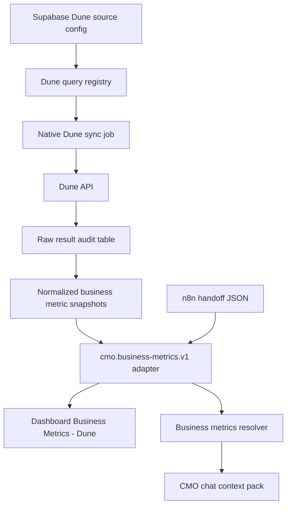

# M12A Dune Native Connector Plan

Planned after audit: 2026-06-19
Scope: proposed requirements only. Do not implement connector in M12A-0.

## Objective

Build a native Product-owned Dune connector that preserves the current dashboard and CMO chat contract while replacing the primary data refresh path with Supabase-backed Dune sync.

Current contract to preserve:

- Dashboard reads `cmo.business-metrics.v1`.
- Resolver returns `cmo.business-metrics-resolver.v1`.
- CMO chat context uses compact `business_metrics_json` summary.
- n8n handoff remains fallback until native Dune parity is proven.

## Recommended Architecture



The native path should write a canonical normalized snapshot first, then adapt it to the existing `cmo.business-metrics.v1` response. That keeps UI and CMO chat changes small.

## Supabase Tables Needed

Existing tables:

- `workspace_metric_sources` is generic enough to hold a Dune source row because it has no `source_type` check constraint.
- `workspace_metric_sync_runs` is generic enough for Dune sync audit.
- `workspace_metric_snapshots`, `workspace_metric_catalogs`, `workspace_metric_query_results`, and `workspace_metric_report_packs` currently constrain `source_type` to `ga4` and `source_id` to `ga4_native`.

Recommended minimum schema:

| Table | Purpose | Notes |
| --- | --- | --- |
| `workspace_metric_sources` | Dune source config row | Use `source_type = dune`, `source_id = dune_native` or `dune`; store non-secret config only. Token/API key should be env/secret ref, not plaintext config. |
| `workspace_dune_query_registry` | Stable query registry | Query id, query name, metric group, expected columns, result grain, timezone, enabled flag, cadence, dashboard mapping version. |
| `workspace_dune_query_results` | Raw/safe Dune result cache | Store bounded rows, execution id, result metadata, row count, fetched_at, query_hash, quality warnings. No secrets. |
| `workspace_business_metric_snapshots` | Normalized business metrics | Store one normalized snapshot per app/source/group/date range with metrics, series, tables, diagnostics, provenance. |
| `workspace_metric_sync_runs` | Sync run audit | Reuse with `source_type = dune`, summary/errors JSON, started/completed timestamps. |
| `workspace_metric_report_packs` or new `workspace_business_metric_report_packs` | Lens/report-pack surface | Prefer Dune-specific pack table unless generic constraints are widened carefully. |

Alternative: widen existing generic metric table constraints from `ga4` to `ga4`, `dune`. This is viable, but current TypeScript data access is GA4-specific, so separate Dune tables reduce blast radius for the first connector.

## Internal Endpoints Needed

Keep current public/Product read endpoints stable:

- `GET /api/cmo/apps/:appId/business-metrics?source=dune&group=wld_aggregator_daily`
- `GET /api/cmo/apps/:appId/business-metrics?source=dune&group=wld_partner_stats_daily`
- `GET /api/cmo/apps/:appId/business-metrics/resolver?source=dune`
- `POST /api/cmo/apps/:appId/metrics/handoff` as fallback

Add internal native endpoints:

| Endpoint | Method | Purpose |
| --- | --- | --- |
| `/api/internal/lens/apps/:appId/dune/sources` | GET/POST | Read/write Dune source config metadata. |
| `/api/internal/lens/apps/:appId/dune/queries` | GET/POST | Manage query registry entries. |
| `/api/internal/lens/apps/:appId/dune/queries/:queryKey/verify` | POST | Verify Dune query id, expected columns, and sample result shape. |
| `/api/internal/lens/apps/:appId/dune/sync` | POST | Run native sync for selected query/group/range. |
| `/api/internal/lens/apps/:appId/dune/report-packs` | GET | Read deterministic Dune report packs for Lens/CMO. |
| `/api/cmo/apps/:appId/business-metrics/native-status` | GET | Dashboard/debug status: last native sync, fallback status, stale state. |

Use the same server-to-server posture as existing Lens internal routes. Do not expose Dune credentials to client components.

## Dune Query Registry Shape

Suggested registry record:

```json
{
  "schemaVersion": "cmo.dune-query-registry.v1",
  "tenantId": "holdstation",
  "workspaceId": "holdstation",
  "appId": "holdstation-mini-app",
  "sourceType": "dune",
  "sourceId": "dune",
  "queryKey": "wld_aggregator_daily",
  "queryId": "TBD",
  "queryName": "holdstation_wld_aggregator_tx",
  "metricGroup": "wld_aggregator_daily",
  "grain": "daily",
  "timezone": "UTC",
  "expectedColumns": [
    "evt_block_date",
    "count_tx",
    "cumulative_tx_count",
    "daily_volume",
    "cumulative_volume",
    "fee_amount"
  ],
  "metricMappings": [
    {
      "metricId": "wld_aggregator_latest_daily_tx",
      "sourceField": "count_tx",
      "aggregation": "latest_by_evt_block_date",
      "unit": "count"
    }
  ],
  "seriesId": "wld_aggregator_daily_series",
  "enabled": true,
  "cadence": "hourly",
  "freshnessSlaMinutes": 180
}
```

Partner registry should include:

- queryKey: `wld_partner_stats_daily`
- queryName: `Partner Stats on WLD`
- expected series columns: `evt_block_date`, `partnerCode`, `volume`, `count_tx`
- expected summary columns: `partnerCode`, `total_volume`, `total_transactions`, `volume_share_pct`, `tx_share_pct`, `active_days`
- top partner mappings:
  - `wld_partner_top_by_volume` from max `total_volume`
  - `wld_partner_top_by_tx` from max `total_transactions`

## Sync Cadence

Recommended:

- Hourly light sync for the latest 7 or 30 days while the Mini App dashboard is actively used.
- Daily deep sync after UTC day close for full historical backfill / report packs.
- Manual sync endpoint for operator recovery.
- Freshness SLA:
  - dashboard healthy: last successful sync <= 3 hours for latest daily window
  - stale warning: 3 to 24 hours
  - missing/error: no successful native or fallback snapshot

Backfill:

1. Run full historical query once per metric group.
2. Store raw bounded result audit.
3. Build normalized snapshots for supported ranges.
4. Compare native output against n8n JSON fallback before switching dashboard default.

## Dashboard Mapping

Keep the visible UI stable:

| Dashboard area | Native source |
| --- | --- |
| WLD Aggregator Daily cards | normalized `workspace_business_metric_snapshots` group `wld_aggregator_daily` metrics |
| WLD Aggregator charts | normalized series id `wld_aggregator_daily_series` |
| Partner Stats cards | normalized group `wld_partner_stats_daily` metrics |
| Partner daily charts | normalized series id `wld_partner_daily_series` |
| Partner share charts | normalized table id `wld_partner_summary` |
| Header status | native freshness + fallback availability |
| Available to CMO Chat badge | resolver status after native/fallback source selection |

Selection rule:

1. Prefer native Supabase snapshot when fresh and valid.
2. Fall back to current JSON/n8n snapshot when native is missing, stale beyond SLA, or invalid.
3. If both missing, return current missing snapshot with `No data`.
4. Include source boundary in diagnostics: `native_dune`, `handoff_json`, or `missing`.

## Lens Report Pack Shape

Create a deterministic Dune report pack parallel to GA4 Lens packs:

```json
{
  "contract": "lens.dune_business_metrics_pack.v1",
  "tenantId": "holdstation",
  "workspaceId": "holdstation",
  "appId": "holdstation-mini-app",
  "source": {
    "sourceType": "dune",
    "sourceId": "dune",
    "provider": "dune_native",
    "queryNames": ["holdstation_wld_aggregator_tx", "Partner Stats on WLD"],
    "syncRunIds": []
  },
  "range": {
    "key": "last_7_days",
    "dateStart": "YYYY-MM-DD",
    "dateEnd": "YYYY-MM-DD",
    "timezone": "UTC"
  },
  "metrics": [],
  "series": [],
  "tables": [],
  "quality": {
    "status": "ready",
    "isStale": false,
    "warnings": []
  },
  "factsForModel": [],
  "groundingRules": [
    "Use Dune / Worldchain as the authoritative Holdstation Mini App business metric source.",
    "Do not use DefiLlama for exact Mini App metrics.",
    "Do not infer missing fee, volume, transaction, or partner values."
  ]
}
```

Keep report pack deterministic. Do not add LLM summaries until the pack and source quality are stable.

## Migration Plan From n8n Fallback To Native

1. Add registry and storage migrations.
2. Add Dune source config with secret reference, not raw token storage.
3. Implement native fetch/verify behind internal endpoints.
4. Normalize native results into the current `cmo.business-metrics.v1` shape.
5. Add parity script comparing native normalized snapshots to existing n8n JSON snapshots.
6. Add dashboard source-status badge that distinguishes native vs fallback without changing metric cards.
7. Enable native as shadow read. Dashboard still uses JSON fallback.
8. Enable native as preferred read when parity and freshness pass.
9. Keep n8n handoff endpoint and JSON fallback for at least one full reporting cycle.
10. After stability, reduce n8n to emergency fallback and documented recovery path.

## Recommended Implementation Order

1. Schema: Dune registry, query result cache, business metric snapshots, sync audit reuse.
2. Types/contracts: Dune query registry, native result, normalized business snapshot, report pack.
3. Dune client: server-only client with timeout, retry, and bounded result handling.
4. Verification endpoint: query id reachable, expected columns present, sample rows valid.
5. Sync job: aggregator daily group first.
6. Sync job: partner stats group second.
7. Native-to-current adapter: return exact existing `cmo.business-metrics.v1`.
8. Resolver source selection: native preferred, JSON fallback.
9. Dashboard status additions only after data path works.
10. Lens Dune pack and context exposure.
11. Parity and freshness checks.
12. Rollout flag / canary for `holdstation-mini-app`.

## Fallbacks To Preserve

- n8n/external handoff POST.
- JSON snapshots at `data/cmo-dashboard/business-metrics/holdstation-mini-app/dune`.
- Current resolver behavior and CMO context pack inclusion logic.
- Vault Markdown snapshot as generated review output.
- DefiLlama compatibility only for old files and old handoff clients.

## Do Not Rebuild Yet

- Do not replace the dashboard chart implementation before native parity.
- Do not merge Dune metrics into GA4 Lens source tables without carefully widening constraints and TypeScript types.
- Do not remove the JSON handoff adapter.
- Do not use Vault Markdown or App Memory as exact metric source.
- Do not add direct client-side Dune calls.
- Do not expose Dune API keys in browser-readable env/config.
- Do not add automated CMO recommendations from Dune until deterministic report packs and quality flags are in place.

## Validation Needed For Future Implementation

- Unit check for registry-to-normalized metric mapping.
- Integration check for Dune API verify endpoint with mocked Dune responses.
- Contract check that native snapshots match `cmo.business-metrics.v1`.
- Parity check against existing n8n JSON handoff.
- Resolver check for native preferred, JSON fallback, and missing states.
- Dashboard check for native/fallback source status and unchanged card labels.
- Context-pack check that business metrics appear only when resolver status is not missing.
